# Exploratory Analysis of Dating Applications

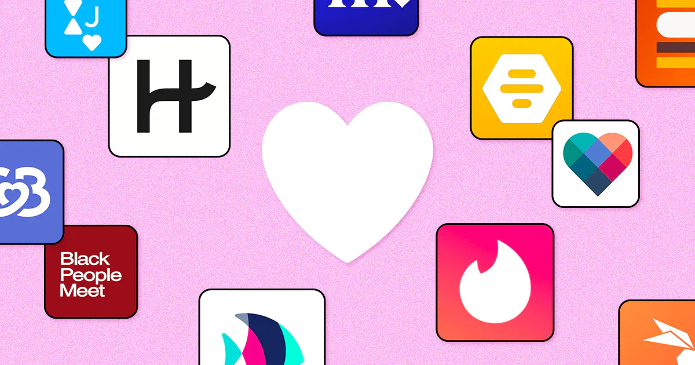

##### Team Members: Ramiro Cervantes, Paola Moreno, Estela Perez

## Background

Covid-19 pandemic affected the way people interacted with one another. Being that the pandemic forced everyone to isolate, not only by mandate, but also by fear of contracting the infection by human contact; people who were looking for courtship began accepting different ways to socialize. Many people turned to dating applications which became more commonly accepted platforms during the pandemic, where they socially connected without any fears of becoming infected. 

## Thesis

Our project will analyze the dating pool within the dating apps Tinder, Hinge and OkCupid. We will provide a summary of demographic data, including, age, race, sex and economic characteristics. We will also be comparing the ratings and “success” rates of the apps to determine their efficiency.
Research Questions

## What does the online dating pool look like?
  * Gender

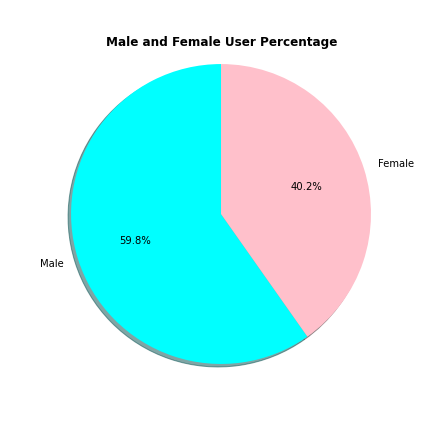
###### Out of OkCupid's most recent data of 59,946 total users

  * Sexual Orientation

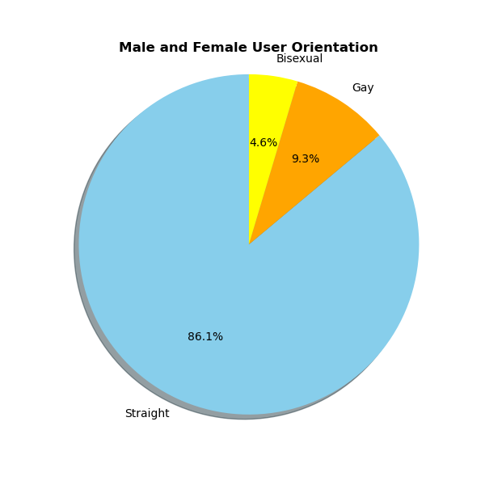
###### Out of OkCupid's most recent data of 59,946 total users

  * Age

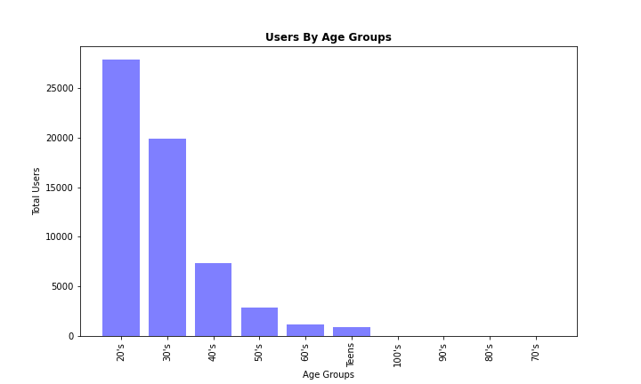
###### Out of OkCupid's most recent data of 59,946 total users

  * Zodiac Sign

###### Out of 59,946 total users only 48,890 shared their zodiac sign

  * Income

###### Out of 35,829 male users only 8,391 responded to their income level
###### Out of 24,117 female users only 3,113 responded to their income level

## When comparing OkCupid, Tinder, and Hinge, which app is the best rated?

  * OkCupid Ratings
  
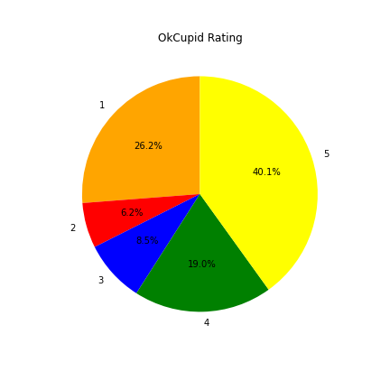

###### (1-5) Star ratings for OkCupid's Google Play Store reviews as of May 2022.

  * Tinder Ratings

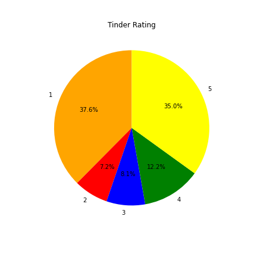

###### (1-5) Star ratings for Tinder's Google Play Store reviews as of May 2022.

  * Hinge Rating

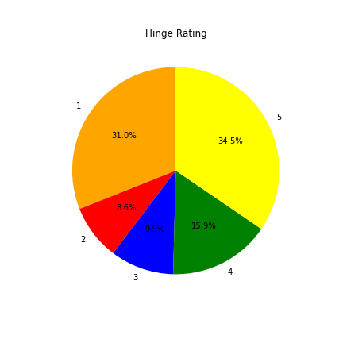

###### (1-5) Star ratings for Hinge's Google Play Store reviewsas of May 2022.

  * Compared Ratings

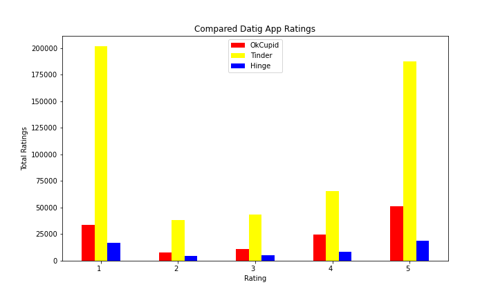

###### Comparison of all three total app reviews.

## How successful are these apps?
We measured the efficiency of the apps using two metrics: Match Rate and Success Rate: whether a match ended in a long-term relationship.

### Match Rate
Using a dataset on Millennial online dating trends, we found that 31% of users actually match with others only about 10% of the time or less. 

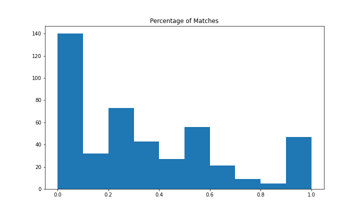

### Success Rate
We also found that of users who actually met with their matches in person, about 29% of them resulted in a long-term relationship. Now, this is how we chose to operationalize success, but we just want to note that not everybody on dating apps is looking for a long-term relationship.

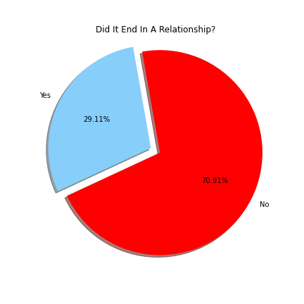

## Has there been a change in the companies' growth due to the pandemic?

The popular dating apps--Tinder, Hinge, and Ok Cupid—are actually owned by the same parent company called Match Group, Inc. 
Using the Alpha Vantage API, we pulled data on the company’s quarterly performance for the last three years to see how it performed through the pandemic. 

We see a slight decrease in Q1 of 2020, which is when social restrictions were first being implemented due to the uncertainty of the pandemic. 
Then we see consistent growth through Q2 of 2021 which suggests that more people took to online dating apps to socialize and find romantic partners. And then we see a gradual decrease since social restrictions began lifting. 

We also pulled data on Bumble, since it’s one of the top competitors. Bumble’s user base grew so much during the peak of the pandemic, that the company went public in Early 2021. After it’s initial boom, we also see a similar trend, with a gradual decrease after lifted restriction on social distancing.

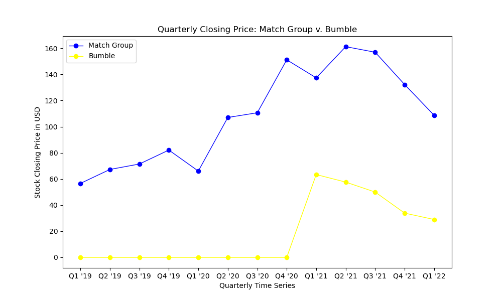

## Conclusion
#### We set off to answer four general questions and we found that:

  * The dating pool is mostly comprised of younger users, has a higher male concentration, and is mostly used by straight users.
  * While Okcupid has a higher rating,  Tinder is the still one of the most commonly used apps to date.
  * Chances of finding a long-term partner on a dating app are slim.
  * Dating app stocks grew in the height of the pandemic and have since decreased due to social distancing being lifted. 

## Limitations and difficulties

The use of secondary data limited our access to and control over the data collected. It was hard to find a dataset that answered our original questions, we had to use multiple datatsets and tweak our questions to fit the data we had. This also limits the generalizability of our findings. 

Use of API proved more difficult than we hoped.

We had a lot of trouble merging our branches. Many branches created and destroyed in the making of this project. 

## Links

### Datasets: 
  * [OkCupid Profiles](https://www.kaggle.com/datasets/andrewmvd/okcupid-profiles)
  * [Tinder Reviews](https://www.kaggle.com/datasets/shivkumarganesh/tinder-google-play-store-review)
  * [Hinge Reviews](https://www.kaggle.com/datasets/shivkumarganesh/hinge-google-play-store-review)
  * [OkCupid Reviews](https://www.kaggle.com/datasets/shivkumarganesh/okcupid-google-play-store-reviews)
  * [Tinder Matches](https://www.kaggle.com/datasets/benroshan/tinder-millennial-match-rate)

### API:
  * [Stock Info API](https://www.alphavantage.co/)

